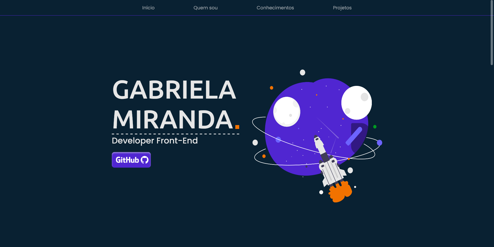

<div align="center"></div>

# My Portfolio
#### Portfolio para apresentação dos meus conhecimentos e projetos 🚀



### 🧪Tecnologias Utilizadas
- Next.Js
- Typescript
- Styled-component
- Api Github
- Axios
- Eslint
- Prettier
- react-slick


## 🚀Como usar

#### clonar o repositório
```bash
git clone https://github.com/Gabriela-Leite/my-porfolio.git

#### instalar as dependências
```bash
yarn ou npm install
```

#### rodando o projeto
```bash
yarn dev ou npm run dev
```

## 💻Deploy
[my portfolio](https://gabriela-miranda.vercel.app/)

## Melhorias a serem feitas
- Acessibilidade
- SEO
- Componentização

##### Opa, bom dia ☀️ por Gabriela Miranda
